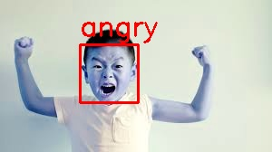
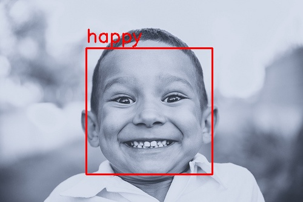

# Facial Expression Recognition

## Overview

This project implements a system for **facial expression recognition** using machine learning techniques. It classifies facial images into various emotion categories, such as happiness, sadness, anger, and more. The project demonstrates the use of multiple machine learning models to achieve this, including **K-Nearest Neighbors (KNN)**, **Convolutional Neural Networks (CNN)**, and **Support Vector Machines (SVM)**.

## Features

- **KNN Image Classification**: Utilizes K-Nearest Neighbors for facial expression classification.
- **CNN with Keras**: Implements a deep learning model based on Convolutional Neural Networks for higher accuracy in expression detection.
- **SVM Classifier**: Applies the Support Vector Machine algorithm for facial expression recognition, a popular method for binary classification tasks.

## Example Output

Here are sample outputs from the system showing emotion recognition with bounding boxes drawn around detected faces:

The images show how the system successfully detects faces, draws bounding boxes around them, and predicts the correct emotions.

## Future Enhancements

- **Model Optimization**: Further optimization of the models to enhance accuracy.
- **Real-Time Processing**: Add support for real-time facial expression recognition from live video feeds.
